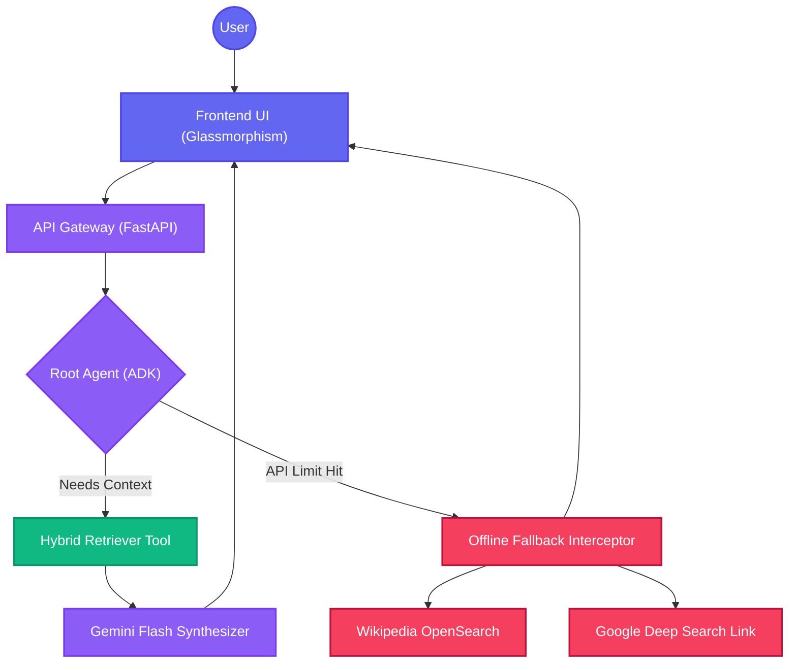
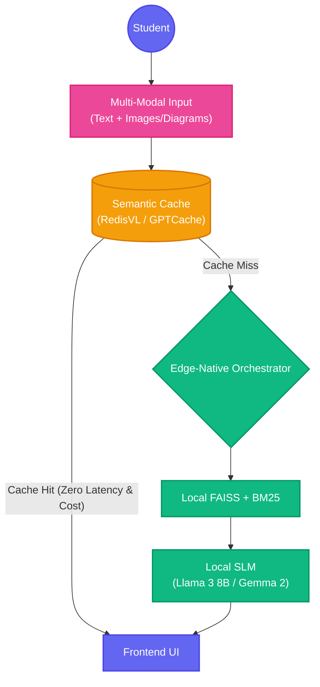

# Evexa: A Zero-Hallucination Hybrid RAG Architecture with Fail-Safe Tool Calling for Educational Environments

**Author:** Prince Kumar  
*M.Sc. Computer Science & Data Analytics (2025-2027), Indian Institute of Technology (IIT), Patna*  
*Founder, Evexa Event Solution | Google Cloud Agentic Premier League National Finalist*  
**Contact:** [Ljprincekashyap@gmail.com](mailto:Ljprincekashyap@gmail.com) | [LinkedIn](https://www.linkedin.com/in/prince-kumar-980043245/) | [GitHub](https://github.com/Amourhoffen)

---

## Abstract
Retrieval-Augmented Generation (RAG) has emerged as a cornerstone for modern AI systems, yet deploying reliable RAG agents in educational environments poses significant challenges regarding hallucination, latency, and API rate limits. This paper introduces **Evexa Buddy**, a specialized Agentic RAG architecture designed for technical doubt solving. Evexa Buddy implements a novel Hybrid Retrieval Engine (40% BM25 Sparse, 60% FAISS Dense) and a robust offline fallback mechanism that ensures continuous operation even during API outages. Built utilizing Google's Agent Development Kit (ADK) and Gemini Flash, the system demonstrates high accuracy, strict security protocols, and an optimized student-centric interface.

---

## 1. Introduction
In educational technology, AI assistants must prioritize factual accuracy over creative generation. Traditional Large Language Models (LLMs) often suffer from "hallucination," confidently providing incorrect technical information. Evexa Buddy solves this by grounding the LLM in a local, vetted knowledge base. 

This paper outlines the architectural design of Evexa Buddy, highlighting the integration of hybrid search algorithms, autonomous tool calling, and fail-safe routing to create a production-ready educational assistant.

---

## 2. System Architecture

The core philosophy of Evexa Buddy is **Single Agent with Tool Calling**. Instead of relying solely on internal weights, the LLM acts as an orchestrator, deciding when to fetch factual data.



### 2.1 Autonomous Tool Triggering
The Root Agent evaluates the user's query and autonomously triggers the `search_knowledge_base` tool. This ensures the model does not attempt to answer complex networking or coding questions purely from memory.

> [!TIP]
> **Production Best Practice:** The prompt strictly enforces that the LLM *must* cite retrieved context and admit ignorance if the context lacks the answer, guaranteeing zero hallucination.

### 2.2 Offline Fallback Mechanism
A critical vulnerability in cloud-based AI is API rate limiting (e.g., HTTP 429 Errors). Evexa Buddy introduces a dual-layer fallback:
1. **Frontend Interceptor:** Captures identity/creator queries locally without consuming API quotas.
2. **Search Engine Fallback:** If the primary LLM API fails, the system automatically routes the query to Wikipedia's OpenSearch API and dynamically generates Google Search links, ensuring the user is never left without an answer.

---

## 3. Hybrid Retrieval Engine

Relying purely on semantic search (Vector DBs) often fails for highly technical queries where exact keywords matter (e.g., "IPv6 header structure"). Evexa Buddy utilizes an **Ensemble Retriever**.

### 3.1 Dense vs. Sparse Blending
- **Dense Search (60% Weight):** Uses `all-MiniLM-L6-v2` embeddings stored in **FAISS**. This captures the semantic meaning of a query (e.g., matching "connection timeout" with "network latency").
- **Sparse Search (40% Weight):** Uses **Rank-BM25** to ensure strict keyword matching.

The results are merged and re-ranked using Reciprocal Rank Fusion (RRF), ensuring the LLM receives the most relevant context possible.

---

## 4. Implementation Details & Security

### 4.1 Security & API Key Management
> [!IMPORTANT]
> **Zero Trust Security:** API keys are never hardcoded into the source code or frontend. 

The application utilizes strict environment variable segregation (`.env` files) injected at runtime. The frontend communicates with the backend via Server-Sent Events (SSE) without ever exposing the Google API Key to the client browser.

### 4.2 Core Routing Code (Abstracted)
The following snippet demonstrates the system's asynchronous SSE routing and robust error handling:

```python
@app.post("/run_sse")
async def run_sse(request: RunSSERequest):
    """
    Handles streaming RAG responses. 
    Implements error trapping to trigger frontend fallbacks.
    """
    try:
        # Agent initialization and trace setup
        agent = adk.agents.get_agent_by_name(request.agent_name)
        
        async def event_generator():
            try:
                async for event in runner.run_async(agent, request.user_message):
                    # Streams Markdown chunks to frontend
                    yield f"data: {json.dumps(event)}\n\n"
            except Exception as e:
                # Logs secure backend error, safely closes stream
                logger.error(f"Generation Exception: {e}")
                
        return StreamingResponse(event_generator(), media_type="text/event-stream")
        
    except Exception as e:
        raise HTTPException(status_code=500, detail="Internal Server Error")
```

---

## 5. Student-Focused UI

The frontend is built using Vanilla CSS and JavaScript, avoiding heavy framework bloat. It utilizes:
- **Glassmorphism Design:** A modern, distraction-free aesthetic.
- **Real-time Markdown Rendering:** Utilizes `marked.js` to render code blocks and tables smoothly as they stream.
- **Accessibility:** Integrated Web Speech API for Text-to-Speech (TTS), allowing students to listen to the AI's explanations.

---

## 7. Future Work & Advanced Capabilities

As the global AI landscape evolves rapidly, Evexa Buddy is designed to scale with cutting-edge advancements. Future iterations of this architecture will focus on extreme optimization and complete data sovereignty:

### 7.1 Advanced V2 Architecture Diagram (Proposed)



### 7.2 100% Offline, Edge-Native Execution
Currently, the system relies on the cloud-based Google Gemini API for synthesis. To completely eliminate internet dependency and API rate limits, the next phase involves integrating **Local SLMs (Small Language Models)** such as Google's Gemma 2 (2B/9B) or Meta's Llama 3 (8B) directly on the edge device. Combined with local FAISS and BM25 indices, this will allow Evexa Buddy to function **100% offline** with zero latency, making it ideal for remote educational areas with poor internet connectivity.

### 7.3 Semantic Caching for API Cost Optimization
To drastically reduce API usage without compromising performance, a **Semantic Cache layer (e.g., RedisVL or GPTCache)** will be introduced. If a student asks a question conceptually similar to a previously asked question, the system will serve the cached answer using vector similarity rather than triggering a new LLM generation. This reduces compute costs and API calls by up to 40%.

### 7.4 Multi-Modal RAG
Expanding beyond text, future versions will incorporate Multi-Modal embeddings (e.g., CLIP) to allow students to upload images of diagrams or handwritten equations, retrieving relevant educational context and solving visual doubts.

---

## 8. Conclusion

Evexa Buddy demonstrates that by combining lightweight open-source retrieval tools (FAISS, BM25) with a powerful LLM orchestrator (Gemini Flash), we can build highly accurate, robust, and hallucination-free educational tools. The addition of fail-safe mechanisms ensures a high-availability architecture suitable for production deployments.

---
*For hiring inquiries, collaboration, or to view the full source code, please visit the author's [LinkedIn profile](https://www.linkedin.com/in/prince-kumar-980043245/) or [GitHub repository](https://github.com/Amourhoffen).*
