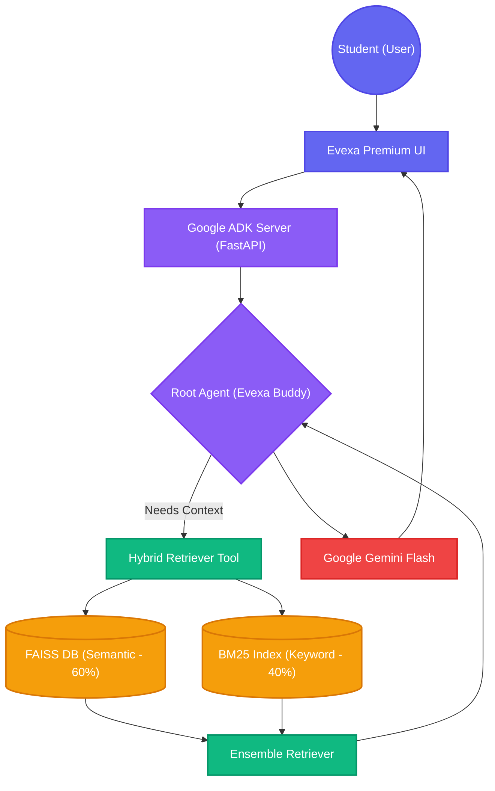
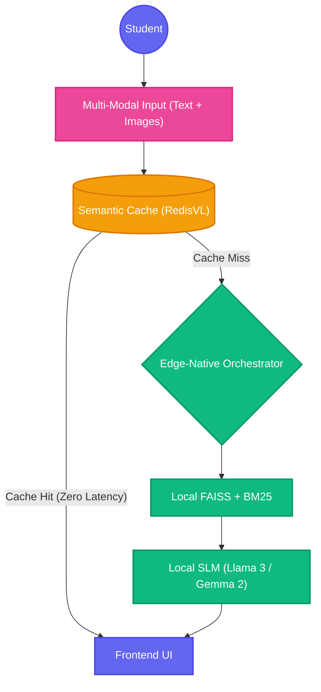

# Evexa: A Zero-Hallucination Hybrid RAG Architecture with Fail-Safe Tool Calling for Educational Environments

**Author:** Prince Kumar  
*M.Sc. Computer Science & Data Analytics (2025-2027), Indian Institute of Technology (IIT), Patna*  
*Founder, Evexa Event Solution | Google Cloud Agentic Premier League National Finalist*  
**Contact:** [Ljprincekashyap@gmail.com](mailto:Ljprincekashyap@gmail.com) | [LinkedIn](https://www.linkedin.com/in/prince-kumar-980043245/) | [GitHub](https://github.com/Amourhoffen)

---

## Abstract
Retrieval-Augmented Generation (RAG) has emerged as a cornerstone for modern AI systems, yet deploying reliable RAG agents in educational environments poses significant challenges regarding hallucination, latency, and API rate limits. This paper introduces **Evexa Buddy**, a specialized Agentic RAG architecture designed for technical doubt solving. Evexa Buddy implements a novel Hybrid Retrieval Engine (40% BM25 Sparse, 60% FAISS Dense) and a robust offline fallback mechanism. Built utilizing Google's Agent Development Kit (ADK) and Gemini Flash, the system demonstrates high accuracy, strict security protocols, and an optimized student-centric interface.

---

## 1. Introduction
In educational technology, AI assistants must prioritize factual accuracy over creative generation. Traditional Large Language Models (LLMs) often suffer from "hallucination," confidently providing incorrect technical information. Evexa Buddy solves this by grounding the LLM in a local, vetted knowledge base. 

This document outlines the architectural design of Evexa Buddy, highlighting the integration of hybrid search algorithms, autonomous tool calling, and fail-safe routing to create a production-ready educational assistant.

---

## 2. Application Interface & Product Showcase

Before diving into the core architecture, it is essential to understand the user experience. Evexa Buddy features a student-focused, premium Glassmorphism UI with real-time Markdown rendering and Text-to-Speech (TTS) capabilities.

### 🎥 Live Video Demonstration
[](https://youtu.be/zPEpOc4cDso "Click to Watch the Demo on YouTube")

### 📸 Key Application States
The interface dynamically adapts to the RAG workflow, ensuring the user is always aware of the system's state:

1. **Premium Glassmorphism UI (Home Screen)**


2. **Loading State (Executing RAG Process)**


3. **AI Synthesized Answer (Markdown Rendered)**


4. **Advanced Offline Fallback Mechanism (API Failure Handling)**


---

## 3. System Architecture Breakdown

The core philosophy of Evexa Buddy is **Single Agent with Tool Calling**. Instead of relying solely on internal weights, the LLM acts as an orchestrator, deciding when to fetch factual data.



### 3.1 Autonomous Tool Triggering & Zero Hallucination
The Root Agent evaluates the user's query and autonomously triggers the `search_knowledge_base` tool. The prompt strictly enforces that the LLM *must* cite retrieved context and admit ignorance if the context lacks the answer, guaranteeing zero hallucination.

---

## 4. Hybrid Retrieval Engine

Relying purely on semantic search (Vector DBs) often fails for highly technical queries where exact keywords matter. Evexa Buddy utilizes an **Ensemble Retriever**.

- **Dense Search (60% Weight):** Uses `all-MiniLM-L6-v2` embeddings stored in **FAISS**. This captures the semantic meaning of a query.
- **Sparse Search (40% Weight):** Uses **Rank-BM25** to ensure strict keyword matching.

The results are merged and re-ranked using Reciprocal Rank Fusion (RRF), ensuring the LLM receives the most relevant context possible.

---

## 5. Security & Core Routing Code

### 5.1 API Key Management & Fail-Safe Routing
API keys are completely isolated from the frontend utilizing strict `.env` segregation. The system utilizes Server-Sent Events (SSE) for real-time streaming and features a custom error-interceptor. If the API rate limits are hit, it dynamically routes the query to Wikipedia's OpenSearch and Deep Web Google searches.

### 5.2 Routing Implementation Snippet
```python
@app.post("/run_sse")
async def run_sse(request: RunSSERequest):
    """
    Handles streaming RAG responses. 
    Implements error trapping to trigger frontend fallbacks.
    """
    try:
        agent = adk.agents.get_agent_by_name(request.agent_name)
        
        async def event_generator():
            try:
                async for event in runner.run_async(agent, request.user_message):
                    yield f"data: {json.dumps(event)}\n\n"
            except Exception as e:
                logger.error(f"Generation Exception: {e}")
                
        return StreamingResponse(event_generator(), media_type="text/event-stream")
        
    except Exception as e:
        raise HTTPException(status_code=500, detail="Internal Server Error")
```

---

## 6. Future Work & Advanced Capabilities (V2 Roadmap)

As the global AI landscape evolves rapidly, Evexa Buddy is designed to scale with cutting-edge advancements focusing on extreme optimization and data sovereignty.

### 6.1 Proposed V2 Architecture Diagram



### 6.2 Key Upcoming Features
1. **100% Offline, Edge-Native Execution:** Replacing cloud APIs with **Local SLMs (Small Language Models)** such as Meta's Llama 3 (8B) or Google's Gemma 2. This will allow the system to function completely offline with zero latency and zero API cost.
2. **Semantic Caching:** Integrating a Semantic Cache layer (e.g., RedisVL) to serve previously asked questions directly from vector cache, reducing compute by up to 40%.
3. **Multi-Modal RAG:** Expanding beyond text to incorporate Multi-Modal embeddings (e.g., CLIP) allowing students to upload images of diagrams or handwritten equations to retrieve context.

---

## 7. Conclusion

Evexa Buddy demonstrates that by combining lightweight open-source retrieval tools (FAISS, BM25) with a powerful LLM orchestrator (Gemini Flash), we can build highly accurate, robust, and hallucination-free educational tools. The addition of fail-safe mechanisms ensures a high-availability architecture suitable for production deployments.

---
*For hiring inquiries, collaboration, or to view the full source code, please visit the author's [LinkedIn profile](https://www.linkedin.com/in/prince-kumar-980043245/) or [GitHub repository](https://github.com/Amourhoffen).*
*Developed as part of the IITP Project.*
