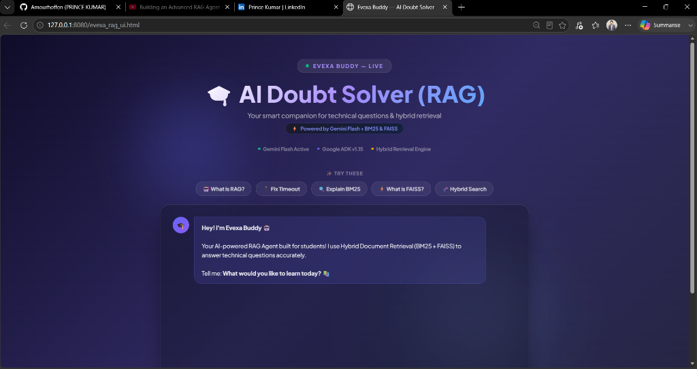
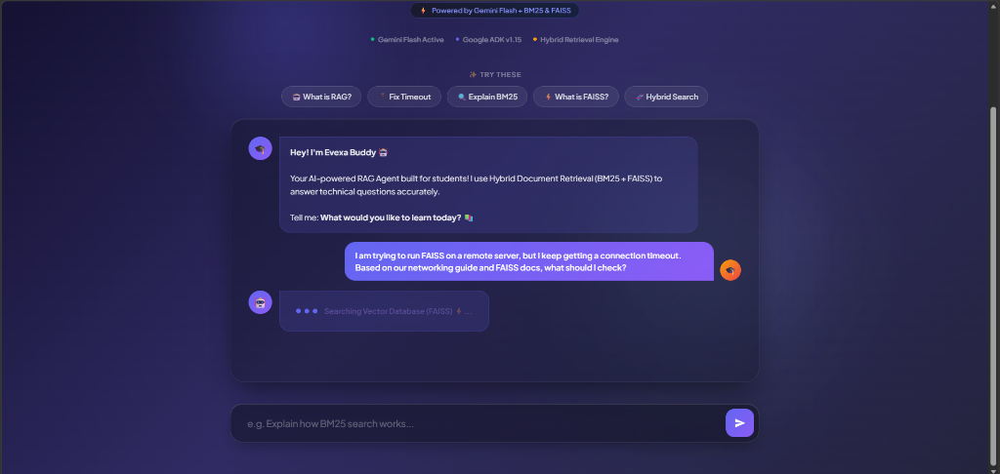
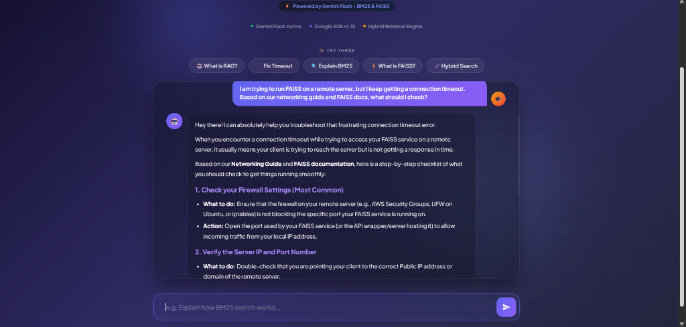
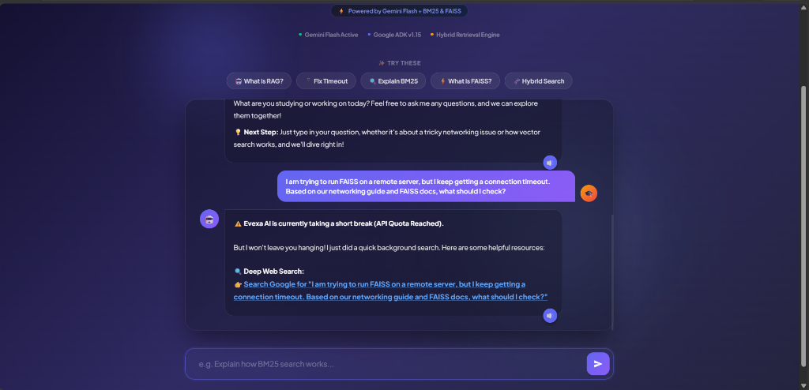
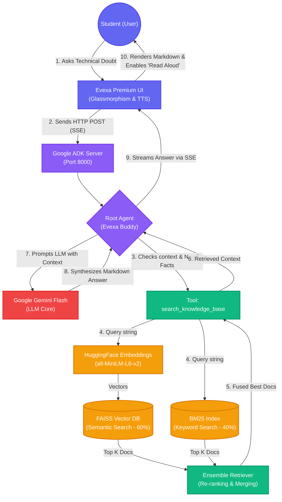

# 🎓 Evexa Buddy — AI Doubt Solver (RAG Agent)

  

### 🎥 Watch the Live Demo
[](https://youtu.be/zPEpOc4cDso "Click to Watch the Demo on YouTube")

**Evexa Buddy** is an advanced Retrieval-Augmented Generation (RAG) agent designed specifically for students to solve complex, technical doubts without hallucination. It achieves this by leveraging a **Hybrid Document Retrieval System** combined with the reasoning power of Google's Gemini Flash.

## ✨ Key Features

- **Hybrid Search Engine:** Combines **BM25** (Sparse Keyword matching - 40% weight) and **FAISS** (Dense Semantic Vector search - 60% weight) to ensure neither exact technical terms nor semantic meanings are missed.
- **Single Agent Architecture:** A highly optimized root agent that autonomous decides when to trigger the `search_knowledge_base` tool to fetch accurate offline data before answering.
- **Student-Focused Premium UI:** A dynamic, responsive interface inspired by modern AI apps (glassmorphism, text-to-speech, markdown rendering, pop-animations).
- **Zero Hallucination:** Answers are strictly synthesized from retrieved technical documents.

---

## 📸 Application Screenshots

### 1. Premium Glassmorphism UI (Home Screen)


### 2. Loading State (Executing RAG Process)


### 3. AI Synthesized Answer (Markdown Rendered)


### 4. Advanced Offline Fallback Mechanism (API Failure Handling)


---

## 🛠️ Tech Stack
- **Framework:** Google ADK (Agent Development Kit)
- **LLM:** Google Gemini Flash
- **Retrieval Engine:** LangChain, FAISS (Facebook AI Similarity Search), Rank-BM25
- **Embeddings:** HuggingFace `all-MiniLM-L6-v2`
- **Frontend:** HTML5, Vanilla CSS (Glassmorphism), JavaScript (`marked.js` for markdown)

---

## 🚀 How to Run the Project Locally

Follow these steps to set up and run the Evexa Buddy Agent on your local machine.

### 1. Clone the Repository
```bash
git clone https://github.com/Amourhoffen/Evexa_RAG_iitp_Project.git
cd Evexa_RAG_iitp_Project
```

### 2. Install Dependencies
Ensure you have Python 3.10+ installed. Install the required libraries:
```bash
pip install -r requirements.txt
pip install google-adk langchain langchain-community faiss-cpu rank_bm25 sentence-transformers
```

### 3. Setup Environment Variables
For security reasons, API keys are not pushed to this repository. You must create a `.env` file in the root directory:
```bash
# Create a file named .env and add your API Key:
GOOGLE_API_KEY="your_gemini_api_key_here"
```

### 4. Start the Agent Backend (ADK Server)
Run the following command to start the backend server on `http://127.0.0.1:8000`:
```bash
adk web
```
*(Note: On the very first query, the system will download and load the `MiniLM` embedding model into RAM. This is a one-time "Cold Start" taking ~30 seconds. Subsequent queries will take < 3 seconds).*

### 5. Open the UI
Simply double-click the **`evexa_rag_ui.html`** file to open it in your browser, or serve it using a local HTTP server:
```bash
python -m http.server 8080
```
Then navigate to `http://127.0.0.1:8080/evexa_rag_ui.html` in your browser.

---

## 🧠 System Architecture Breakdown

### Advanced Flow & Architecture Diagram
The system uses a **Single Agent with Tool Calling** pattern. Below is the detailed workflow:



1. **User Query Input:** The user types a technical doubt in the UI.
2. **Tool Invocation:** The ADK Agent recognizes the need for factual data and triggers the RAG Tool.
3. **Hybrid Retrieval:** 
   - FAISS converts the query to vectors using `all-MiniLM-L6-v2` and finds conceptually similar docs.
   - BM25 searches for exact keyword matches.
   - An Ensemble Retriever merges and re-ranks these results.
4. **Synthesis:** Gemini Flash reads the top retrieved documents and formulates a structured, markdown-formatted answer.
5. **UI Rendering:** The frontend renders the markdown beautifully and offers a Text-to-Speech (Read Aloud) option for students.

---
*Developed as part of the IITP Project.*
